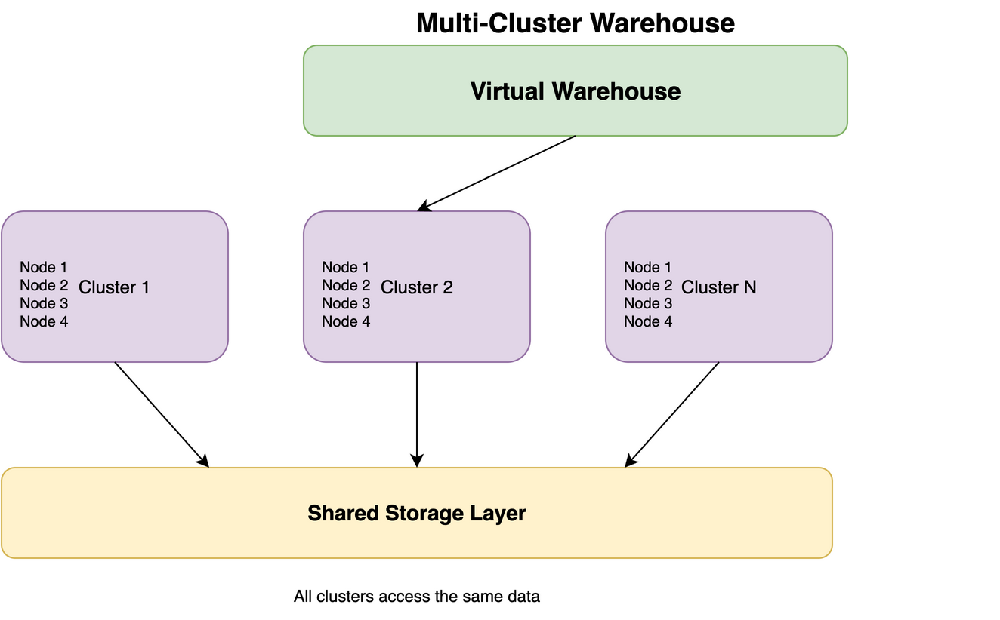

# Virtual Warehouses

## Overview

Virtual Warehouses (VWs) are the compute resources in Snowflake. They are independent clusters of compute nodes that execute SQL queries and perform data processing operations.

## Key Concepts

- **Isolation**: Each warehouse operates independently
- **Scalability**: Can be resized dynamically
- **Cost Control**: Auto-suspend when idle
- **Concurrency**: Multiple warehouses can run simultaneously

## Warehouse States



```
┌─────────────┐
│   Running   │ ← Active, processing queries
└──────┬──────┘
       │
       ├──→ Auto-suspend (after idle timeout)
       │
┌──────▼──────┐
│  Suspended  │ ← Stopped, no compute charges
└──────┬──────┘
       │
       ├──→ Resume (manual or auto)
       │
┌──────▼──────┐
│   Resizing  │ ← Transitioning between sizes
└─────────────┘
```

## Warehouse Operations

### Creating a Warehouse

```sql
CREATE WAREHOUSE my_warehouse
  WITH WAREHOUSE_SIZE = 'MEDIUM'
  AUTO_SUSPEND = 300
  AUTO_RESUME = TRUE
  INITIALLY_SUSPENDED = TRUE;
```

### Resizing a Warehouse

```sql
ALTER WAREHOUSE my_warehouse SET WAREHOUSE_SIZE = 'LARGE';
```

### Suspending/Resuming

```sql
-- Suspend manually
ALTER WAREHOUSE my_warehouse SUSPEND;

-- Resume manually
ALTER WAREHOUSE my_warehouse RESUME;
```

## Warehouse Configuration

### Size Selection
- **Small workloads**: X-Small, Small
- **Medium workloads**: Medium, Large
- **Large workloads**: X-Large and above
- **Rule of thumb**: Start small, scale up as needed

### Auto-Suspend
- **Purpose**: Automatically suspend when idle
- **Default**: 600 seconds (10 minutes)
- **Best practice**: Set based on usage patterns
- **Cost impact**: No compute charges when suspended

### Auto-Resume
- **Purpose**: Automatically resume when queries arrive
- **Default**: TRUE
- **Consideration**: Small delay on first query after suspend

## Multi-Cluster Warehouses

### When to Use
- High concurrency (many concurrent users)
- Mixed workload patterns
- BI tools with many concurrent queries

### Configuration

```sql
ALTER WAREHOUSE my_warehouse
  SET MIN_CLUSTER_COUNT = 1
      MAX_CLUSTER_COUNT = 3
      SCALING_POLICY = 'STANDARD';
```

### Scaling Policies
- **STANDARD**: Adds clusters gradually as load increases
- **ECONOMY**: More conservative, waits longer before adding clusters

## Warehouse Best Practices

1. **Right-Sizing**: Start small, monitor, then adjust
2. **Auto-Suspend**: Enable for cost savings
3. **Separate Workloads**: Use different warehouses for different workloads
4. **Multi-Cluster**: Use for high concurrency scenarios
5. **Monitor Usage**: Track warehouse utilization and costs

## Common Patterns

### Development Warehouse
- Small size
- Auto-suspend: 60 seconds
- Low concurrency

### Production Warehouse
- Medium to Large size
- Auto-suspend: 300-600 seconds
- Multi-cluster if needed

### ETL Warehouse
- Large size
- Auto-suspend: 600+ seconds
- Dedicated for ETL jobs

