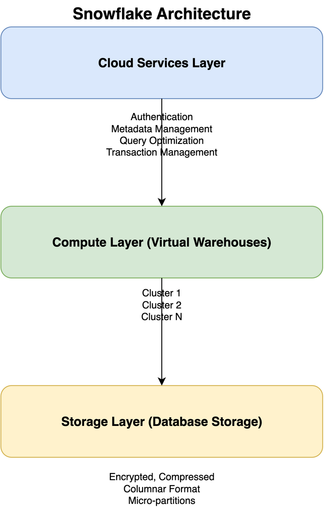

# Snowflake Architecture

## Overview

Snowflake's architecture is unique in that it separates storage, compute, and cloud services into three distinct layers. This separation enables independent scaling and provides the foundation for Snowflake's performance and flexibility.

## Three-Layer Architecture



```
┌─────────────────────────────────────────────────────────┐
│              Cloud Services Layer                        │
│  (Authentication, Metadata, Query Optimization, etc.)    │
└─────────────────────────────────────────────────────────┘
                        ↕
┌─────────────────────────────────────────────────────────┐
│              Compute Layer (Virtual Warehouses)          │
│  ┌──────────┐  ┌──────────┐  ┌──────────┐              │
│  │ Cluster 1│  │ Cluster 2│  │ Cluster N│              │
│  └──────────┘  └──────────┘  └──────────┘              │
└─────────────────────────────────────────────────────────┘
                        ↕
┌─────────────────────────────────────────────────────────┐
│              Storage Layer (Database Storage)            │
│  (Encrypted, compressed, columnar format)                │
└─────────────────────────────────────────────────────────┘
```

## Layer Details

### 1. Cloud Services Layer
- **Purpose**: Coordinates all activities across Snowflake
- **Functions**:
  - Authentication and access control
  - Infrastructure management
  - Metadata management
  - Query parsing and optimization
  - Transaction management
  - Security
- **Characteristics**: 
  - No compute resources required
  - Automatically scales
  - Highly available

### 2. Compute Layer (Virtual Warehouses)
- **Purpose**: Execute queries and perform data processing
- **Components**:
  - Virtual Warehouses (VWs): Independent compute clusters
  - Each VW consists of multiple compute nodes
  - Can be resized dynamically
- **Characteristics**:
  - Independent scaling
  - Multiple VWs can run simultaneously
  - Auto-suspend and auto-resume
  - Multi-cluster support for concurrency

### 3. Storage Layer
- **Purpose**: Store all data in Snowflake
- **Characteristics**:
  - Encrypted at rest
  - Compressed and columnar format
  - Automatically managed by Snowflake
  - Scales automatically
  - Shared across all compute clusters

## Virtual Warehouses

Virtual Warehouses are the compute resources in Snowflake. They are independent clusters that can be:
- **Created**: With specific sizes (X-Small to 6X-Large)
- **Resized**: Up or down at any time
- **Suspended**: When not in use (saves costs)
- **Resumed**: Automatically or manually
- **Cloned**: For testing or development

### Warehouse Sizes

| Size | Credits/Hour | Compute Nodes |
|------|--------------|---------------|
| X-Small | 1 | 1 |
| Small | 2 | 2 |
| Medium | 4 | 4 |
| Large | 8 | 8 |
| X-Large | 16 | 16 |
| 2X-Large | 32 | 32 |
| 3X-Large | 64 | 64 |
| 4X-Large | 128 | 128 |
| 5X-Large | 256 | 256 |
| 6X-Large | 512 | 512 |

## Multi-Cluster Warehouses

- **Purpose**: Handle concurrent queries automatically
- **How it works**: 
  - Automatically adds clusters when load increases
  - Removes clusters when load decreases
  - All clusters access the same data
- **Use cases**: 
  - High concurrency workloads
  - Mixed workload patterns
  - BI tools with many concurrent users

## Data Storage Format

- **Columnar Storage**: Data stored in columns for better compression and query performance
- **Micro-partitions**: Automatic partitioning (16MB compressed, up to 500MB uncompressed)
- **Metadata**: Rich metadata for query optimization
- **Compression**: Automatic compression (typically 3-5x)

## Key Architectural Benefits

1. **Separation of Concerns**: Storage and compute can scale independently
2. **Concurrency**: Multiple users can query simultaneously without contention
3. **Elasticity**: Scale up or down in seconds
4. **Cost Efficiency**: Pay only for compute when it's running
5. **No Data Movement**: All compute clusters access the same storage

