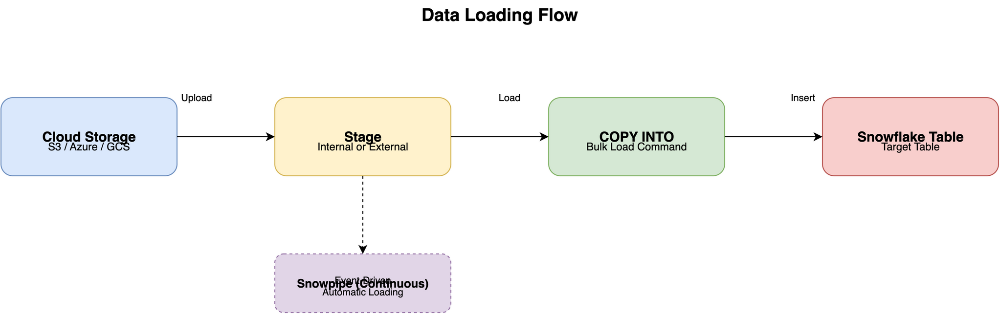

# Data Loading in Snowflake

## Overview

Snowflake provides multiple methods to load data into tables. The choice of loading method depends on data volume, frequency, and source system.

## Loading Methods



```
┌─────────────────────────────────────────┐
│         Data Loading Methods            │
├─────────────────────────────────────────┤
│                                         │
│  1. Bulk Loading (COPY INTO)           │
│     - Large, one-time loads            │
│     - Batch processing                 │
│                                         │
│  2. Continuous Loading (Snowpipe)      │
│     - Real-time or near-real-time      │
│     - Automated, event-driven          │
│                                         │
│  3. INSERT Statements                   │
│     - Small volumes                    │
│     - Ad-hoc inserts                   │
│                                         │
│  4. External Tables                     │
│     - Query data without loading        │
│     - Data lake integration            │
│                                         │
└─────────────────────────────────────────┘
```

## Bulk Loading with COPY INTO

### Overview
The `COPY INTO` command is the primary method for bulk loading data into Snowflake tables.

### Supported File Formats
- CSV/TSV
- JSON
- Avro
- ORC
- Parquet
- XML

### Basic Syntax

```sql
COPY INTO target_table
FROM @stage_name/path/to/files
FILE_FORMAT = (TYPE = 'CSV')
PATTERN = '.*data.*[.]csv';
```

### Loading from External Stage

```sql
-- Create external stage
CREATE STAGE my_s3_stage
  URL = 's3://my-bucket/data/'
  CREDENTIALS = (AWS_KEY_ID = '...' AWS_SECRET_KEY = '...');

-- Load data
COPY INTO my_table
FROM @my_s3_stage
FILE_FORMAT = (TYPE = 'CSV');
```

### Loading from Internal Stage

```sql
-- Create internal stage
CREATE STAGE my_internal_stage;

-- Upload file (via SnowSQL or UI)
PUT file:///local/path/data.csv @my_internal_stage;

-- Load data
COPY INTO my_table
FROM @my_internal_stage
FILE_FORMAT = (TYPE = 'CSV');
```

## File Format Options

### CSV Format

```sql
CREATE FILE FORMAT csv_format
  TYPE = 'CSV'
  COMPRESSION = 'AUTO'
  FIELD_DELIMITER = ','
  RECORD_DELIMITER = '\n'
  SKIP_HEADER = 1
  FIELD_OPTIONALLY_ENCLOSED_BY = '"'
  TRIM_SPACE = TRUE
  ERROR_ON_COLUMN_COUNT_MISMATCH = FALSE
  ESCAPE = 'NONE'
  ESCAPE_UNENCLOSED_FIELD = '\134'
  DATE_FORMAT = 'AUTO'
  TIMESTAMP_FORMAT = 'AUTO';
```

### JSON Format

```sql
CREATE FILE FORMAT json_format
  TYPE = 'JSON'
  COMPRESSION = 'AUTO'
  ENABLE_OCTAL = FALSE
  ALLOW_DUPLICATE = FALSE
  STRIP_OUTER_ARRAY = FALSE
  STRIP_NULL_VALUES = FALSE
  IGNORE_UTF8_ERRORS = FALSE;
```

## Loading Best Practices

1. **Use Appropriate Warehouse Size**: Larger warehouses load faster
2. **Parallel Loading**: Load multiple files simultaneously
3. **File Size**: Optimal file size is 100-250MB (compressed)
4. **Compression**: Use compressed files (gzip, bzip2) for faster loading
5. **Error Handling**: Use ON_ERROR option to handle errors gracefully

## Error Handling

```sql
COPY INTO my_table
FROM @my_stage
FILE_FORMAT = (TYPE = 'CSV')
ON_ERROR = 'CONTINUE'  -- or 'ABORT_STATEMENT', 'SKIP_FILE'
VALIDATION_MODE = 'RETURN_ERRORS';
```

## Loading Validation

```sql
-- Validate without loading
COPY INTO my_table
FROM @my_stage
FILE_FORMAT = (TYPE = 'CSV')
VALIDATION_MODE = 'RETURN_ERRORS';

-- Check load history
SELECT * FROM TABLE(INFORMATION_SCHEMA.LOAD_HISTORY(
  TABLE_NAME => 'MY_TABLE'
));
```

## Performance Optimization

### Warehouse Sizing
- Use larger warehouses for faster loads
- Consider dedicated warehouse for loading

### File Optimization
- Compress files (gzip recommended)
- Optimal file size: 100-250MB compressed
- Multiple smaller files better than one large file

### Parallel Loading
- Load multiple files simultaneously
- Snowflake automatically parallelizes

## Common Loading Scenarios

### Loading from S3

```sql
CREATE STAGE s3_stage
  URL = 's3://bucket/path/'
  CREDENTIALS = (AWS_KEY_ID = 'key' AWS_SECRET_KEY = 'secret');

COPY INTO my_table
FROM @s3_stage
FILE_FORMAT = (TYPE = 'CSV');
```

### Loading from Azure Blob

```sql
CREATE STAGE azure_stage
  URL = 'azure://account.blob.core.windows.net/container/path/'
  CREDENTIALS = (AZURE_SAS_TOKEN = 'token');

COPY INTO my_table
FROM @azure_stage
FILE_FORMAT = (TYPE = 'CSV');
```

### Loading from GCS

```sql
CREATE STAGE gcs_stage
  URL = 'gcs://bucket/path/'
  CREDENTIALS = (GCS_SERVICE_ACCOUNT = 'service_account_key');

COPY INTO my_table
FROM @gcs_stage
FILE_FORMAT = (TYPE = 'CSV');
```

## Monitoring Loads

```sql
-- Check load status
SELECT 
    FILE_NAME,
    STATUS,
    ROWS_LOADED,
    ROWS_PARSED,
    ERROR_COUNT
FROM TABLE(INFORMATION_SCHEMA.LOAD_HISTORY(
    TABLE_NAME => 'MY_TABLE'
))
ORDER BY LAST_LOAD_TIME DESC;
```

