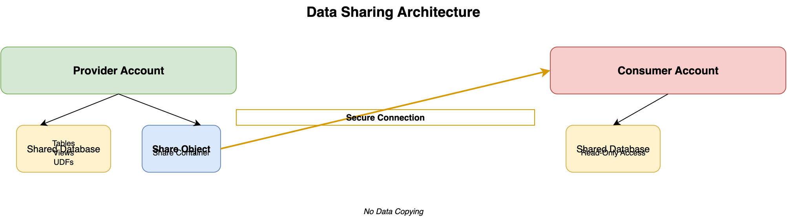

# Data Sharing in Snowflake

## Overview

Data Sharing enables secure, real-time data sharing between Snowflake accounts without copying or moving data. It's a core feature that allows organizations to share data with partners, customers, or other business units instantly.

## Data Sharing Architecture



```
┌─────────────────────────────────────────┐
│         Provider Account                │
│                                         │
│  ┌──────────────┐                      │
│  │ Shared       │                      │
│  │ Database     │                      │
│  └──────┬───────┘                      │
│         │                               │
│         │ Share                         │
│         ▼                               │
│  ┌──────────────┐                      │
│  │ Share Object │                      │
│  └──────┬───────┘                      │
│         │                               │
└─────────┼───────────────────────────────┘
          │
          │ Secure Connection
          │
┌─────────▼───────────────────────────────┐
│         Consumer Account                │
│                                         │
│  ┌──────────────┐                      │
│  │ Shared       │                      │
│  │ Database     │                      │
│  │ (Read-Only)  │                      │
│  └──────────────┘                      │
│                                         │
└─────────────────────────────────────────┘
```

## Key Concepts

### Provider
- Account that shares data
- Creates shares and grants access
- No additional storage costs

### Consumer
- Account that receives shared data
- Read-only access
- No storage costs (data remains in provider account)

### Share
- Container for database objects to share
- Can contain databases, schemas, tables, views, UDFs
- Secure, encrypted connection

## Types of Data Sharing

### 1. Direct Sharing (Same Cloud/Region)
- Provider and consumer in same cloud provider
- Same region preferred for performance
- Most common type

### 2. Cross-Cloud Sharing
- Provider and consumer in different clouds
- Supported but with performance considerations
- Additional latency possible

### 3. Listing (Data Marketplace)
- Public or private listings
- Provider publishes data products
- Consumers can discover and subscribe

## Creating a Share

### Step 1: Create Share Object

```sql
CREATE SHARE my_share;
```

### Step 2: Grant Objects to Share

```sql
-- Grant database
GRANT USAGE ON DATABASE my_database TO SHARE my_share;

-- Grant schema
GRANT USAGE ON SCHEMA my_database.my_schema TO SHARE my_share;

-- Grant table
GRANT SELECT ON TABLE my_database.my_schema.my_table TO SHARE my_share;

-- Grant view
GRANT SELECT ON VIEW my_database.my_schema.my_view TO SHARE my_share;
```

### Step 3: Add Consumer Accounts

```sql
-- Add consumer account
ALTER SHARE my_share
  ADD ACCOUNTS = consumer_account_identifier;

-- Add multiple accounts
ALTER SHARE my_share
  ADD ACCOUNTS = account1, account2, account3;
```

## Consumer Side

### Viewing Available Shares

```sql
SHOW SHARES;
```

### Creating Database from Share

```sql
CREATE DATABASE shared_db FROM SHARE provider_account.my_share;
```

### Accessing Shared Data

```sql
-- Query shared data like any other table
SELECT * FROM shared_db.schema.table;
```

## Share Management

### Viewing Share Details

```sql
-- Show shares
SHOW SHARES;

-- Describe share
DESC SHARE my_share;

-- Show grants on share
SHOW GRANTS ON SHARE my_share;
```

### Modifying Shares

```sql
-- Add more objects
GRANT SELECT ON TABLE new_table TO SHARE my_share;

-- Remove consumer
ALTER SHARE my_share
  REMOVE ACCOUNTS = consumer_account;

-- Add more consumers
ALTER SHARE my_share
  ADD ACCOUNTS = new_consumer_account;
```

### Dropping Shares

```sql
-- First, remove all consumers
ALTER SHARE my_share REMOVE ACCOUNTS = consumer_account;

-- Then drop share
DROP SHARE my_share;
```

## Security Considerations

1. **Principle of Least Privilege**: Grant only necessary objects
2. **Row-Level Security**: Use secure views for filtered data
3. **Column Masking**: Use dynamic data masking
4. **Audit**: Monitor share usage
5. **Access Control**: Regularly review consumer access

## Secure Views for Data Sharing

### Creating Secure View

```sql
CREATE SECURE VIEW shared_schema.filtered_view AS
SELECT 
  col1,
  col2,
  -- Exclude sensitive columns
FROM source_table
WHERE region = 'US';  -- Filter rows
```

### Granting Secure View

```sql
GRANT SELECT ON VIEW shared_schema.filtered_view TO SHARE my_share;
```

## Data Marketplace

### Provider Side (Publishing)

```sql
-- Create listing
CREATE LISTING my_listing
  TITLE = 'My Data Product'
  DESCRIPTION = 'Description of data product';

-- Add share to listing
ALTER LISTING my_listing
  ADD SHARE my_share;
```

### Consumer Side (Subscribing)

1. Browse Snowflake Data Marketplace
2. Find and request listing
3. Provider approves
4. Consumer creates database from share

## Best Practices

1. **Use Secure Views**: Filter sensitive data
2. **Monitor Usage**: Track consumer queries
3. **Documentation**: Document shared objects
4. **Version Control**: Manage share changes carefully
5. **Testing**: Test shares before production
6. **Naming Conventions**: Use clear naming for shares

## Monitoring Shares

```sql
-- Provider: View share usage
SELECT * FROM SNOWFLAKE.ACCOUNT_USAGE.SHARE_USAGE;

-- Consumer: View shared database usage
SELECT * FROM SNOWFLAKE.ACCOUNT_USAGE.DATABASE_STORAGE_USAGE_HISTORY
WHERE DATABASE_NAME = 'SHARED_DB';
```

## Common Use Cases

1. **Partner Data Sharing**: Share data with business partners
2. **Multi-Division Sharing**: Share within organization
3. **Data Marketplace**: Publish data products
4. **Vendor Data**: Receive vendor data
5. **Compliance**: Share data for regulatory requirements

