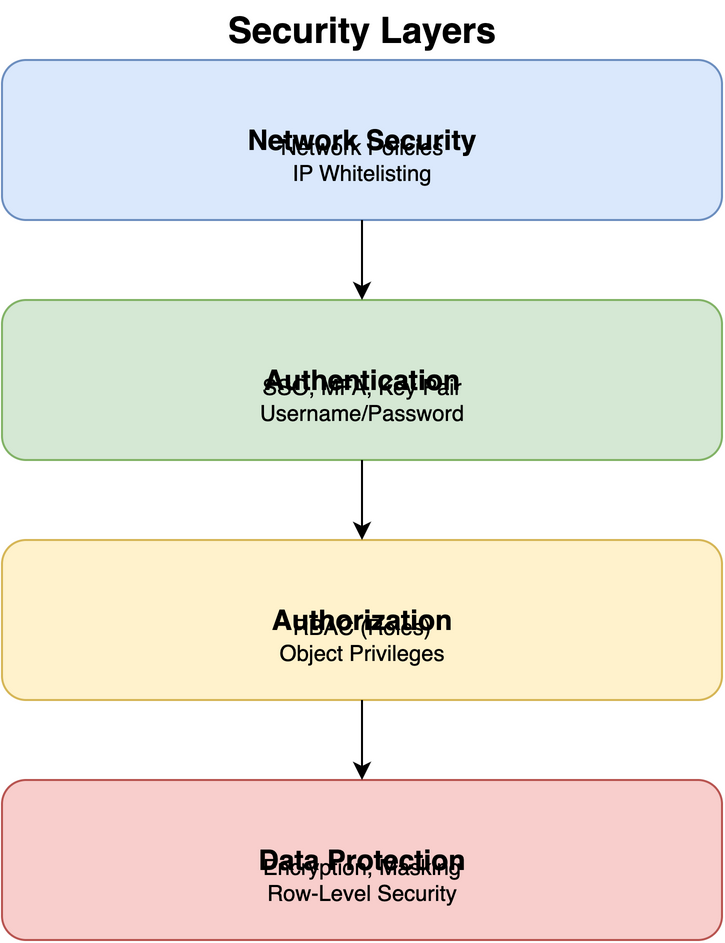

# Security in Snowflake

## Overview

Snowflake provides comprehensive security features including authentication, authorization, encryption, network policies, and compliance capabilities. Security is built into every layer of the Snowflake architecture.

## Security Layers



```
┌─────────────────────────────────────────┐
│      Network Security                   │
│  (Network Policies, IP Whitelisting)    │
└─────────────────────────────────────────┘
              ↕
┌─────────────────────────────────────────┐
│      Authentication                     │
│  (SSO, MFA, Key Pair, OAuth)            │
└─────────────────────────────────────────┘
              ↕
┌─────────────────────────────────────────┐
│      Authorization                      │
│  (RBAC, Object Privileges)              │
└─────────────────────────────────────────┘
              ↕
┌─────────────────────────────────────────┐
│      Data Protection                    │
│  (Encryption, Masking, Row-Level)       │
└─────────────────────────────────────────┘
```

## Authentication

### User Authentication Methods

1. **Username/Password**
   - Default authentication method
   - Password policies enforced

2. **SSO (Single Sign-On)**
   - SAML 2.0
   - OAuth
   - External OAuth providers

3. **Key Pair Authentication**
   - RSA key pairs
   - More secure than passwords
   - Required for programmatic access

4. **Multi-Factor Authentication (MFA)**
   - Time-based one-time password (TOTP)
   - SMS (limited support)
   - Required for enhanced security

### Creating Users

```sql
-- Basic user
CREATE USER john_doe
  PASSWORD = 'secure_password'
  MUST_CHANGE_PASSWORD = TRUE;

-- User with MFA
CREATE USER jane_doe
  PASSWORD = 'secure_password'
  MFA_ENABLED = TRUE;

-- User with expiration
CREATE USER temp_user
  PASSWORD = 'secure_password'
  EXPIRES_AT = DATEADD(DAYS, 90, CURRENT_TIMESTAMP());
```

### Key Pair Authentication Setup

```sql
-- 1. Generate key pair (on client)
-- ssh-keygen -t rsa -b 2048 -f rsa_key

-- 2. Set public key for user
ALTER USER john_doe SET RSA_PUBLIC_KEY = 'MIIBIjANBgkqhkiG9w0BAQEFAAOCAQ8A...';
```

## Authorization - Role-Based Access Control (RBAC)

### Role Hierarchy

```
┌─────────────────┐
│  ACCOUNTADMIN   │ (Top-level)
└────────┬────────┘
         │
    ┌────┴────┐
    │         │
┌───▼───┐ ┌──▼────┐
│SYSADMIN│ │SECURITY│
└───┬───┘ └───────┘
    │
┌───▼────────┐
│  USERADMIN │
└────────────┘
```

### System-Defined Roles

1. **ACCOUNTADMIN**
   - Highest level privileges
   - Manage account-level settings
   - Use sparingly

2. **SECURITYADMIN**
   - Manage users, roles, privileges
   - Cannot manage warehouses/databases

3. **USERADMIN**
   - Create and manage users and roles
   - Limited to user management

4. **SYSADMIN**
   - Create and manage warehouses, databases, objects
   - Typical role for data engineers

5. **PUBLIC**
   - Default role for all users
   - Minimal privileges

### Creating Custom Roles

```sql
-- Create role
CREATE ROLE data_analyst;

-- Grant privileges
GRANT USAGE ON WAREHOUSE my_warehouse TO ROLE data_analyst;
GRANT USAGE ON DATABASE my_database TO ROLE data_analyst;
GRANT SELECT ON ALL TABLES IN SCHEMA my_database.my_schema TO ROLE data_analyst;

-- Grant role to user
GRANT ROLE data_analyst TO USER john_doe;
```

### Object Privileges

```sql
-- Database privileges
GRANT USAGE ON DATABASE my_database TO ROLE analyst;
GRANT CREATE SCHEMA ON DATABASE my_database TO ROLE analyst;

-- Schema privileges
GRANT USAGE ON SCHEMA my_database.my_schema TO ROLE analyst;
GRANT CREATE TABLE ON SCHEMA my_database.my_schema TO ROLE analyst;

-- Table privileges
GRANT SELECT ON TABLE my_table TO ROLE analyst;
GRANT INSERT, UPDATE, DELETE ON TABLE my_table TO ROLE analyst;

-- Warehouse privileges
GRANT USAGE ON WAREHOUSE my_warehouse TO ROLE analyst;
GRANT OPERATE ON WAREHOUSE my_warehouse TO ROLE analyst;
```

## Network Security

### Network Policies

```sql
-- Create network policy
CREATE NETWORK POLICY my_policy
  ALLOWED_IP_LIST = ('192.168.1.0/24', '10.0.0.0/8')
  BLOCKED_IP_LIST = ('192.168.1.100');

-- Assign to account
ALTER ACCOUNT SET NETWORK_POLICY = my_policy;

-- Assign to user
ALTER USER john_doe SET NETWORK_POLICY = my_policy;
```

## Data Protection

### Encryption

- **At Rest**: AES-256 encryption (automatic)
- **In Transit**: TLS 1.2+ (automatic)
- **Key Management**: 
  - Snowflake-managed (default)
  - Customer-managed keys (Enterprise+)

### Dynamic Data Masking

```sql
-- Create masking policy
CREATE MASKING POLICY email_mask AS (val STRING) RETURNS STRING ->
  CASE 
    WHEN CURRENT_ROLE() IN ('ADMIN') THEN val
    ELSE REGEXP_REPLACE(val, '(.*)@(.*)', '***@\\2')
  END;

-- Apply to column
ALTER TABLE users MODIFY COLUMN email 
  SET MASKING POLICY email_mask;
```

### Row-Level Security

```sql
-- Create row access policy
CREATE ROW ACCESS POLICY dept_policy AS (dept STRING) RETURNS BOOLEAN ->
  CURRENT_ROLE() = 'ADMIN' OR 
  CURRENT_ROLE() = 'DEPT_' || dept;

-- Apply to table
ALTER TABLE employees ADD ROW ACCESS POLICY dept_policy ON (department);
```

### Secure Views

```sql
-- Create secure view (definition visible only to authorized users)
CREATE SECURE VIEW filtered_data AS
SELECT col1, col2
FROM sensitive_table
WHERE region = CURRENT_ROLE();
```

## Audit and Compliance

### Query History

```sql
-- View query history
SELECT 
    QUERY_TEXT,
    USER_NAME,
    ROLE_NAME,
    START_TIME,
    END_TIME,
    TOTAL_ELAPSED_TIME
FROM SNOWFLAKE.ACCOUNT_USAGE.QUERY_HISTORY
WHERE START_TIME >= DATEADD(DAYS, -7, CURRENT_TIMESTAMP())
ORDER BY START_TIME DESC;
```

### Access History

```sql
-- View access history
SELECT 
    QUERY_START_TIME,
    USER_NAME,
    ROLE_NAME,
    OBJECT_DOMAIN,
    OBJECT_NAME,
    QUERY_TEXT
FROM SNOWFLAKE.ACCOUNT_USAGE.ACCESS_HISTORY
WHERE QUERY_START_TIME >= DATEADD(DAYS, -7, CURRENT_TIMESTAMP());
```

### Login History

```sql
-- View login history
SELECT 
    EVENT_TIMESTAMP,
    USER_NAME,
    CLIENT_IP,
    IS_SUCCESS,
    ERROR_MESSAGE
FROM SNOWFLAKE.ACCOUNT_USAGE.LOGIN_HISTORY
WHERE EVENT_TIMESTAMP >= DATEADD(DAYS, -7, CURRENT_TIMESTAMP());
```

## Best Practices

1. **Principle of Least Privilege**: Grant minimum necessary privileges
2. **Role-Based Access**: Use roles, not direct user grants
3. **MFA**: Enable MFA for all users
4. **Network Policies**: Restrict access by IP when possible
5. **Regular Audits**: Review access and privileges regularly
6. **Secure Views**: Use secure views for sensitive data
7. **Data Masking**: Mask sensitive columns
8. **Key Rotation**: Rotate keys regularly
9. **Password Policies**: Enforce strong password policies
10. **Monitor Access**: Regularly review access logs

