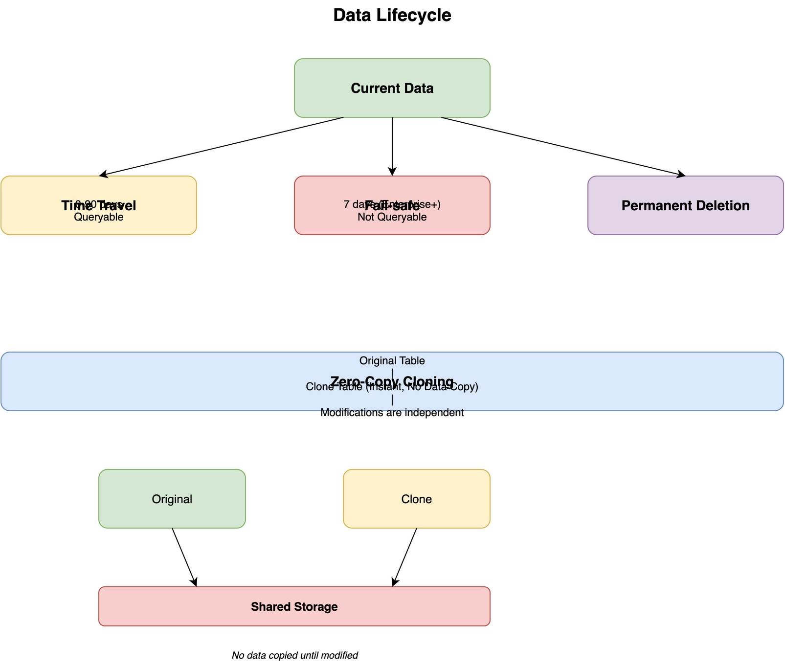

# Advanced Features in Snowflake

## Overview

Snowflake provides several advanced features that set it apart from traditional data warehouses, including Time Travel, Zero-Copy Cloning, Fail-safe, and more. These features enable powerful data management capabilities.

## Advanced Features Overview

```
┌─────────────────────────────────────────┐
│      Advanced Features                  │
├─────────────────────────────────────────┤
│                                         │
│  1. Time Travel                         │
│  2. Zero-Copy Cloning                   │
│  3. Fail-safe                           │
│  4. Streams                             │
│  5. Tasks                               │
│  6. Stored Procedures                   │
│  7. User-Defined Functions              │
│  8. External Tables                     │
│                                         │
└─────────────────────────────────────────┘
```

## Time Travel

### Overview

Time Travel enables accessing historical data at any point in time within a retention period. This is useful for data recovery, auditing, and analyzing data changes.

### Retention Periods

- **Standard**: 1 day (default)
- **Enterprise**: Up to 90 days
- **Configurable**: Per table or account level

### Time Travel Operations

```sql
-- Query historical data (1 hour ago)
SELECT * FROM my_table
AT (OFFSET => -3600);  -- seconds

-- Query at specific timestamp
SELECT * FROM my_table
AT (TIMESTAMP => '2024-01-15 10:00:00'::TIMESTAMP);

-- Query before statement
SELECT * FROM my_table
BEFORE (STATEMENT => 'statement_id');

-- Restore table to previous point
CREATE TABLE restored_table CLONE my_table
AT (TIMESTAMP => '2024-01-15 10:00:00'::TIMESTAMP);

-- Undrop table
UNDROP TABLE my_table;
```

### Time Travel Architecture



```
Current Data
    │
    ├──→ Time Travel (0-90 days)
    │    - Queryable historical data
    │    - Restore capabilities
    │
    └──→ Fail-safe (7 days, Enterprise+)
         - Not queryable
         - Disaster recovery only
```

## Zero-Copy Cloning

### Overview

Zero-Copy Cloning creates instant, cost-effective copies of databases, schemas, or tables without duplicating data. Clones share the same storage until data is modified.

### Creating Clones

```sql
-- Clone table
CREATE TABLE new_table CLONE original_table;

-- Clone schema
CREATE SCHEMA new_schema CLONE original_schema;

-- Clone database
CREATE DATABASE new_database CLONE original_database;

-- Clone at specific point in time
CREATE TABLE new_table CLONE original_table
AT (TIMESTAMP => '2024-01-15 10:00:00'::TIMESTAMP);
```

### Clone Behavior

- **Instant**: No data copying
- **Cost-Effective**: No storage cost until modified
- **Independent**: Modifications don't affect original
- **Metadata Only**: Only metadata is copied initially

### Use Cases

1. **Testing**: Test changes without affecting production
2. **Development**: Create dev environments quickly
3. **Backup**: Quick backup before major changes
4. **Analytics**: Create analytical copies

## Fail-safe

### Overview

Fail-safe provides disaster recovery protection. Data in fail-safe is not queryable and is only used for disaster recovery scenarios.

### Characteristics

- **Duration**: 7 days (Enterprise+)
- **Not Queryable**: Cannot query fail-safe data
- **Automatic**: Managed by Snowflake
- **Disaster Recovery**: Only for catastrophic failures

### Data Lifecycle

```
Active Data → Time Travel → Fail-safe → Permanent Deletion
```

## Streams

### Overview

Streams provide change data capture (CDC) capabilities, tracking changes to tables for processing.

### Creating Streams

```sql
-- Standard stream (tracks all changes)
CREATE STREAM my_stream ON TABLE my_table;

-- Append-only stream (INSERTs only)
CREATE STREAM append_stream ON TABLE my_table
APPEND_ONLY = TRUE;

-- Insert-only stream (INSERTs only, no metadata)
CREATE STREAM insert_stream ON TABLE my_table
INSERT_ONLY = TRUE;
```

### Stream Operations

```sql
-- Query stream
SELECT * FROM my_stream;

-- Process changes
INSERT INTO target_table
SELECT * FROM my_stream
WHERE METADATA$ACTION = 'INSERT';

-- Consume stream (marks records as consumed)
INSERT INTO target_table
SELECT * FROM my_stream;
```

### Stream Metadata

- **METADATA$ACTION**: INSERT, DELETE, or UPDATE
- **METADATA$ISUPDATE**: TRUE if UPDATE
- **METADATA$ROW_ID**: Unique row identifier

## Tasks

### Overview

Tasks enable scheduling SQL statements, including stored procedures, for automated data processing.

### Creating Tasks

```sql
-- Basic task
CREATE TASK my_task
  WAREHOUSE = my_warehouse
  SCHEDULE = 'USING CRON 0 2 * * * UTC'
AS
  INSERT INTO summary_table
  SELECT * FROM source_table;

-- Task with stream
CREATE TASK process_stream
  WAREHOUSE = my_warehouse
  SCHEDULE = '1 MINUTE'
WHEN SYSTEM$STREAM_HAS_DATA('my_stream')
AS
  INSERT INTO target_table
  SELECT * FROM my_stream;
```

### Task Management

```sql
-- Resume task
ALTER TASK my_task RESUME;

-- Suspend task
ALTER TASK my_task SUSPEND;

-- Modify task
ALTER TASK my_task SET SCHEDULE = 'USING CRON 0 3 * * * UTC';

-- View task history
SELECT * FROM TABLE(INFORMATION_SCHEMA.TASK_HISTORY(
  SCHEDULED_TIME_RANGE_START => DATEADD(HOUR, -24, CURRENT_TIMESTAMP())
));
```

## Stored Procedures

### Overview

Stored procedures enable encapsulating business logic in reusable SQL/JavaScript code.

### Creating Stored Procedures

```sql
-- SQL stored procedure
CREATE OR REPLACE PROCEDURE process_data()
RETURNS STRING
LANGUAGE SQL
AS
$$
  BEGIN
    INSERT INTO summary_table
    SELECT * FROM source_table;
    RETURN 'Success';
  END;
$$;

-- JavaScript stored procedure
CREATE OR REPLACE PROCEDURE calculate_total(amount FLOAT)
RETURNS FLOAT
LANGUAGE JAVASCRIPT
AS
$$
  return AMOUNT * 1.1;  // Add 10% tax
$$;
```

### Calling Stored Procedures

```sql
-- Call procedure
CALL process_data();

-- Call with parameters
CALL calculate_total(100.0);
```

## User-Defined Functions (UDFs)

### Overview

UDFs enable creating custom functions for use in SQL queries.

### Creating UDFs

```sql
-- SQL UDF
CREATE OR REPLACE FUNCTION calculate_tax(amount FLOAT)
RETURNS FLOAT
AS
$$
  amount * 0.1
$$;

-- JavaScript UDF
CREATE OR REPLACE FUNCTION format_phone(phone STRING)
RETURNS STRING
LANGUAGE JAVASCRIPT
AS
$$
  return PHONE.replace(/(\d{3})(\d{3})(\d{4})/, '($1) $2-$3');
$$;
```

### Using UDFs

```sql
SELECT 
  amount,
  calculate_tax(amount) AS tax,
  format_phone(phone) AS formatted_phone
FROM sales;
```

## External Tables

### Overview

External tables enable querying data in external storage (S3, Azure, GCS) without loading into Snowflake.

### Creating External Tables

```sql
-- External table from S3
CREATE EXTERNAL TABLE external_sales
WITH LOCATION = @s3_stage/sales/
FILE_FORMAT = (TYPE = 'PARQUET')
PATTERN = '.*sales.*[.]parquet';

-- Query external table
SELECT * FROM external_sales
WHERE date >= '2024-01-01';
```

### Benefits

- **No Data Movement**: Query data in place
- **Cost Effective**: No storage costs
- **Real-Time**: Always current data
- **Flexible**: Multiple file formats

## Best Practices

1. **Time Travel**: Set appropriate retention periods
2. **Cloning**: Use for testing and development
3. **Streams**: Combine with tasks for CDC
4. **Tasks**: Monitor task execution history
5. **Stored Procedures**: Encapsulate complex logic
6. **UDFs**: Create reusable functions
7. **External Tables**: Use for data lake queries

