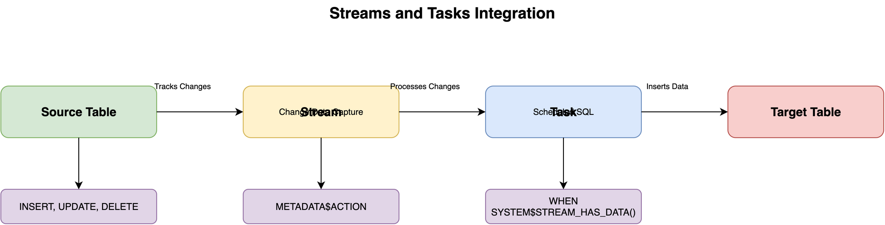

# Automation in Snowflake

## Overview

Snowflake provides several automation capabilities including Tasks, Streams, and integration with external orchestration tools for building automated data pipelines.

## Automation Components



```
┌─────────────────────────────────────────┐
│      Automation Tools                   │
├─────────────────────────────────────────┤
│                                         │
│  1. Tasks (Scheduled SQL)              │
│  2. Streams (Change Data Capture)      │
│  3. Stored Procedures                  │
│  4. External Orchestration             │
│                                         │
└─────────────────────────────────────────┘
```

## Tasks

### Overview

Tasks enable scheduling SQL statements to run automatically on a schedule or when triggered by events.

### Creating Tasks

```sql
-- Scheduled task
CREATE TASK daily_summary
  WAREHOUSE = my_warehouse
  SCHEDULE = 'USING CRON 0 2 * * * UTC'
AS
  INSERT INTO daily_summary_table
  SELECT DATE_TRUNC('DAY', created_at), COUNT(*)
  FROM source_table
  WHERE created_at >= CURRENT_DATE() - 1
  GROUP BY DATE_TRUNC('DAY', created_at);
```

### Task Dependencies

```sql
-- Parent task
CREATE TASK extract_data
  WAREHOUSE = my_warehouse
  SCHEDULE = 'USING CRON 0 1 * * * UTC'
AS
  COPY INTO staging_table FROM @external_stage;

-- Child task (runs after parent)
CREATE TASK transform_data
  WAREHOUSE = my_warehouse
  AFTER extract_data
AS
  INSERT INTO final_table
  SELECT * FROM staging_table;
```

## Streams and Tasks Integration

### Change Data Capture Pattern

```sql
-- Create stream
CREATE STREAM change_stream ON TABLE source_table;

-- Create task to process stream
CREATE TASK process_changes
  WAREHOUSE = my_warehouse
  SCHEDULE = '1 MINUTE'
WHEN SYSTEM$STREAM_HAS_DATA('change_stream')
AS
  INSERT INTO target_table
  SELECT * FROM change_stream
  WHERE METADATA$ACTION = 'INSERT';
```

## Best Practices

1. **Error Handling**: Implement error handling in tasks
2. **Monitoring**: Regularly check task execution history
3. **Warehouse Sizing**: Use appropriate warehouse sizes
4. **Dependencies**: Properly configure task dependencies
5. **Testing**: Test tasks before production deployment

